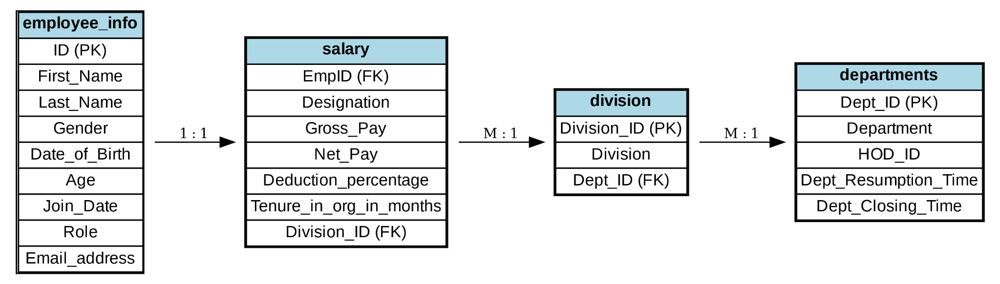

# 🏢 Max Holdings — Full SQL Project  

  
  
  

---

## 📘 Project Overview  

This project demonstrates advanced **SQL (MySQL)** techniques for end-to-end data management and analytics on **HR and payroll data** from **Max Holdings**.  

It covers:  
- 🧱 Database creation and schema design  
- 🧹 Data cleaning and transformation  
- 🧩 CTEs, Window Functions, and Views  
- 📈 Business insights and analytics  

The goal is to showcase both **technical SQL proficiency** and **strategic business thinking** through actionable insights.  

---

## 📂 Project Structure  

```plaintext
Max_Holdings_SQL_Project/
│── Max_Holdings_full_project.sql    # Main SQL script (original)
│── README.md                        # Documentation (this file)
│── Max_Holdings_ERD.png             # Entity Relationship Diagram
│── data/
│   ├── employee_info.csv
│   ├── salary.csv
│   ├── departments.csv
│   └── division.csv
```

---

## 🧭 Database Schema  

The database contains four key tables:  

| Table | Description |
|:------|:-------------|
| **employee_info** | Employee demographics, IDs, and roles |
| **salary** | Payroll details (gross, net, deductions, tenure) |
| **departments** | Department info (HOD, resumption/closing times) |
| **division** | Business divisions linked to departments |

📊 **Entity Relationship Diagram (ERD)**  

Below is the visual schema representation:  



---

## 🛠 SQL Expertise Demonstrated  

This project showcases a wide range of SQL capabilities:  

✅ Database setup & normalization  
✅ Data cleaning: handling duplicates, nulls, and incorrect types  
✅ Data transformation using analytic views  
✅ Modular analysis with CTEs  
✅ Advanced analytics with Window Functions (ROW_NUMBER, RANK, DENSE_RANK)  
✅ Aggregations & joins for performance insights  

---

## 🔍 Highlighted Queries & Insights  

### 1️⃣ Duplicate Records Detection with CTE + Window Function  

```sql
WITH Duplicate_emp AS (
    SELECT emp_unique_id, ID, First_Name, Last_Name,
           ROW_NUMBER() OVER(PARTITION BY ID ORDER BY emp_unique_id) AS entry_no
    FROM employee_info
)
SELECT * 
FROM Duplicate_emp
WHERE entry_no > 1
ORDER BY ID;
```

**Insight:**  
Duplicate employee entries were detected and removed to ensure data integrity.  

---

### 2️⃣ Gender Balance Analysis  

```sql
SELECT Gender, COUNT(*) AS EmployeeCount
FROM employee_info
GROUP BY Gender;
```

**Insight:**  
Workforce distribution shows **72% Male** vs **28% Female**, indicating a gender imbalance.  

---

### 3️⃣ Salary Disparities Across Departments  

```sql
SELECT Department, ROUND(AVG(Net_Pay), 2) AS AvgNetSalary
FROM raw_view
GROUP BY Department
ORDER BY AvgNetSalary DESC;
```

**Insight:**  
| Department | Avg. Net Salary ($) | Observation |
|-------------|----------------------|--------------|
| Legal & Compliance | ~11,287 | 💰 Highest |
| Finance | ~2,500 | ⚠️ Lowest |  
Significant pay gaps across departments highlight internal inequality.  

---

### 4️⃣ Tenure vs Salary Correlation  

```sql
SELECT Tenure_in_org_in_months,
       ROUND(AVG(Net_Pay), 2) AS AvgNetSalary
FROM raw_view
GROUP BY Tenure_in_org_in_months
ORDER BY Tenure_in_org_in_months;
```

**Insight:**  
Short-tenured employees (< 1 year) earn disproportionately high salaries — possibly due to executive hires or pay misalignment.  

---

### 5️⃣ Age Distribution of Workforce  

```sql
SELECT Age, COUNT(*) AS EmployeeCount
FROM employee_info
GROUP BY Age
ORDER BY EmployeeCount DESC;
```

**Insight:**  
The majority of employees are **26–35 years old**, confirming a young, mid-career workforce.  

---

## 📈 Key Business Insights  

| # | Insight |
|:-:|:--------|
| 1 | Workforce is young (avg ~32 years) but **gender-imbalanced** (72% male). |
| 2 | **Salary disparities** exist across departments. |
| 3 | **Succession risk** due to aging leaders in key roles. |
| 4 | **Tenure-pay inversion** – new hires earn more than long-tenured staff. |
| 5 | **Payroll anomalies** suggest data entry or structural inconsistencies. |

---

## 🚀 Business Recommendations  

1. 👩‍💼 **Gender Equity** → Implement targeted female hiring and mentorship programs.  
2. 👨‍🏫 **Succession Planning** → Groom younger employees for leadership roles.  
3. 💵 **Compensation Review** → Standardize pay bands to address disparities.  
4. 🔄 **Retention Strategy** → Introduce bonuses and recognition for tenure.  
5. 🧹 **Data Quality Improvements** → Deploy validation checks on payroll data.  

---

## 🧾 Tools & Technologies  

| Category | Tools |
|-----------|-------|
| Database | MySQL |
| Language | SQL |
| Visualization | ERD (draw.io / dbdiagram.io) |
| Data Source | CSV (Employee, Salary, Departments, Division) |

---

## 🏆 Author  

**Paul Egeonu**  
_Data Analyst | SQL Developer_  

[LinkedIn](https://linkedin.com/in/your-link) • [Portfolio](https://your-portfolio-link.com) • [GitHub](https://github.com/yourusername)

---

### ⭐ How to Use  

1. Import the `.sql` file into your MySQL environment.  
2. Load the CSV files into corresponding tables.  
3. Run the queries to reproduce the results and insights.  
4. Review the ERD for schema understanding.  

---

### 📌 Status: **Complete**  
This project demonstrates strong SQL fundamentals, business acumen, and analytical storytelling.  
